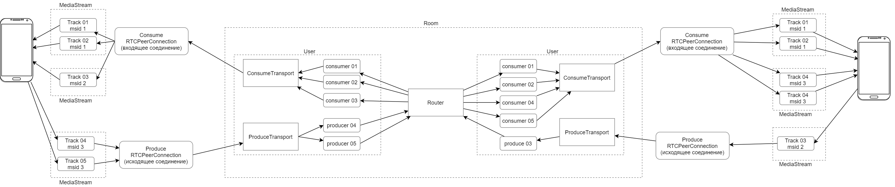

# Архитектура и дизайн

Основное назначение микросервиса - обеспечить обертку библиотеки [mediasoup](https://mediasoup.org/)
для взаимодействия с нативными устройствами.

## Функионал

Медиасервер преобразует стандартные компоненты библиотеки mediasoup в нативный SDP.

Также, медиасервер отвечает за создание и удаление компонентов mediasoup, таких как Router, Transport и Consumers/Producers.

## Основные компоненты WebRTC

* *RTCPeerConnection* - объект, отвечающий за соединение WebRTC. В данный объект можно добавлять дорожки, или же наоборот,
доставать из него дорожки

* *Answer/Offer* - объекты, содержащие в себе строку SDP, в которой указаны все необходимые данные для подключения и кодирования
медиа-потоков

* *Track* - аудио- или видео-дорожка. Аудио и видео данные кодируются отдельно друг от друга и отправляются разными пакетами.
В SDP указываются допустимые кодеки дорожки, битрейт, а также прочие RTP параметры

* *MediaStream* - объект, объединяющий несколько дорожек в один медиа-поток. 
Так как дорожки рассинхронизированны изначально между собой, MediaStream занимается тем, что объединяет и сихронизирует
аудио и видео между собой. В SDP указывается полем msid. При этом на клиенте и на сервере msid совпадает, что позволяет
отправлять его вместе с прочей информацией, чтобы синхронизировать потоки и их пользователей

## Основные компоненты MediaSoup

[Дизайн библиотеки mediasoup](https://mediasoup.org/documentation/v3/mediasoup/design/#architecture)

* *Worker* - основной объект, который производит вычисления. 
С увеличением нагрузки следует увеличивать количество Worker, и балансировать нагрузку между ними

* *Router* занимается тем, что перенаправляет входящие потоки в исходящие.
По сути он является комнатой для конференции, однако, в случае увеличения количества участников, можно соединять разные Router между собой

* *WebRtcTransport* соединяет конечные точки с роутером и обеспечивает передачу данных при помощи созданных в нем
объектов Producer и Consumer

* *Producer* отвечает за один входящий поток (видео или аудио) с одного клиента на сервер

* *Consumer* отвечает за один исходящий поток с сервера к одному клиенту

## Логика работы

Во первых, следует заметить, что для каждого пользователя используется максимум 2 соединения: одно соединение для **всех**
входящих потоков, и одно соединение для всех исходящих потоков. Каждый поток содержит в себе одну дорожку (*Track*)

### Подключение нового пользователя

При подключении нового пользователя в комнату медиасервер автоматически создаёт объект ConsumeTransport, а также
создаёт для него объекты Consumers для всех входящих дорожек.

### Передача данных

Для передачи данных с клиента на сервер клиент формирует свой SDP, в котором указывает, 
сколько дорожек он хочет транслировать. Затем этот SDP парсится на медиасервере и создаёт объекты 
ProduceTransport и необходимое кол-во Producers в нём. Затем, для каждого пользователя в комнате
создаются объекты Consumers, также по кол-ву входящих дорожек от пользователя. 

После этого для каждого клиента формируется новый SDP исходя из всех добавленных для него ранее Consumers.
